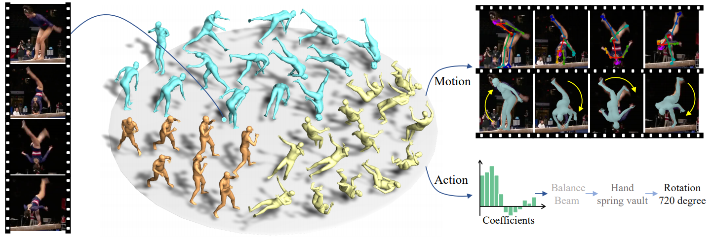
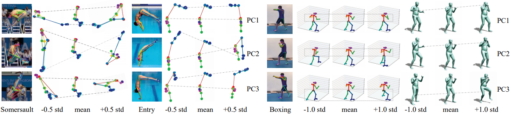

# SportsCap: Monocular 3D Human Motion Capture and Fine-grained Understanding in Challenging Sports Videos
### [ProjectPage](https://chenxin.tech/SportsCap.html) | [Paper](https://arxiv.org/abs/2104.11452) | [Video](https://chenxin.tech/files/Paper/IJCV2020_Sport/project_page_SportsCap/data/video.mp4) |  [Dataset](xx)
[Xin Chen](https://chenxin.tech/), Anqi Pang, [Wei Yang](https://scholar.google.com/citations?user=fRjxdPgAAAAJ&hl=en), [Yuexin Ma](http://yuexinma.me/aboutme.html), [Lan Xu](http://xu-lan.com/), [Kun Zhou](http://kunzhou.net/), [Jingyi Yu](http://www.yu-jingyi.com/).</br>


This repository contains the official implementation for the paper: [SportsCap: Monocular 3D Human Motion Capture and Fine-grained Understanding in Challenging Sports Videos (IJCV 2021)](https://arxiv.org/abs/2104.11452). Our work is capable of simultaneously capturing 3D human motions and understanding fine-grained actions from monocular challenging sports video input.<br>
<p float="left">
  
</p>
<br>

[comment]: <> (This is a comment, it will not be included)
[comment]: <> (in  the output file unless you use it in)
[comment]: <> (a reference style link.)
[//]: <> (This is also a comment.)
[//]: # (This may be the most platform independent comment)

## Abstract
Markerless motion capture and understanding of professional non-daily human movements is an important yet unsolved task, which suffers from complex motion patterns and severe self-occlusion, especially for the monocular setting. In this paper, we propose SportsCap -- the first approach for simultaneously capturing 3D human motions and understanding fine-grained actions from monocular challenging sports video input. Our approach utilizes the semantic and temporally structured sub-motion prior in the embedding space for motion capture and understanding in a data-driven multi-task manner. Comprehensive experiments on both public and our proposed datasets show that with a challenging monocular sports video input, our novel approach not only significantly improves the accuracy of 3D human motion capture, but also recovers accurate fine-grained semantic action attributes.

[comment]: <To enable robust capture under complex motion patterns, we propose an effective motion embedding module to recover both the implicit motion embedding and explicit 3D motion details via a corresponding mapping function as well as a sub-motion classifier. Based on such hybrid motion information, we introduce a multi-stream spatial-temporal Graph Convolutional Network(ST-GCN) to predict the fine-grained semantic action attributes, and adopt a semantic attribute mapping block to assemble various correlated action attributes into a high-level action label for the overall detailed understanding of the whole sequence, so as to enable various applications like action assessment or motion scoring.> 


## Licenses
<a rel="license" href="http://creativecommons.org/licenses/by-nc-sa/4.0/"></a><br />This work is licensed under a <a rel="license" href="http://creativecommons.org/licenses/by-nc-sa/4.0/">Creative Commons Attribution-NonCommercial-ShareAlike 4.0 International License</a>.

All material is made available under [Creative Commons BY-NC-SA 4.0](https://creativecommons.org/licenses/by-nc-sa/4.0/legalcode) license. You can **use, redistribute, and adapt** the material for **non-commercial purposes**, as long as you give appropriate credit by **citing our paper** and **indicating any changes** that you've made.

## The SMART Dataset
SportsCap proposes a challenging sports dataset called Sports Motion and Recognition Tasks (SMART) dataset, which contains per-frame action labels, manually annotated pose and action assessment of various challenging sports video clips from professional referees.

<p float="left">
  
</p>

### Download
You can download the SMART dataset (XX GB, version 1.0) from [GoogleDrive](https://drive.google.com/file/d/1O62Tp-2pPncuKD8oKbkP_WZJcbj-f_ik/view?usp=sharing).

### Annotation
Coming soon.

### Tools
Coming soon.
<!-- The code consists of two modules, as mentioned in our paper, the learning module (image to mask) and the graphics module (mask to 3d mesh). The first module follows the framework of FCIS and Mask RCNN. A common learning framework with Python. The second module is built based on Unity3D and our own framework. The purpose of the second module is to sweep the profiles with a dynamic demo.

If you have any questions, feel free to ask (chenxin2@shanghaitech.edu.cn). Please refer to the code scripts for second module: 
```
AutoSweep_ObjectSnapping/Assets/BodyEngine.cs
AutoSweep_ObjectSnapping/Assets/FaceEngine.cs
AutoSweep_ObjectSnapping/Assets/GraphicsEngine.cs
``` -->

## Sports Motion Embedding Spaces
With the annotated 2D poses and MoCap 3D pose data, we collect the Sports Motion Embedding Spaces (SMES), the 2D/3D pose priors for various sports. SMES provides strong prior and regularization to ensure that the generated pose result lies in the corresponding action space.
<p float="left">
  
</p>

### Download
You can download the Motion Embedding Spaces (SMES) (XX MB, version 1.0) separately from [GoogleDrive](https://drive.google.com/file/d/1O62Tp-2pPncuKD8oKbkP_WZJcbj-f_ik/view?usp=sharing). The released SMES-V1.0 includes xxx

### Useage
Coming soon.

## Citation
If you find our code or paper useful, please consider citing:
```
@article{chen2021sportscap,
  title={SportsCap: Monocular 3D Human Motion Capture and Fine-grained Understanding in Challenging Sports Videos},
  author={Chen, Xin and Pang, Anqi and Yang, Wei and Ma, Yuexin and Xu, Lan and Yu, Jingyi},
  journal={arXiv preprint arXiv:2104.11452},
  year={2021}
}
```

## Relevant Works
[**ChallenCap: Monocular 3D Capture of Challenging Human Performances using Multi-Modal References (CVPR Oral 2021)**](https://arxiv.org/abs/2103.06747)<br>
Yannan He, Anqi Pang, Xin Chen, Han Liang, Minye Wu, Yuexin Ma, Lan Xu

[**TightCap: 3D Human Shape Capture with Clothing Tightness Field (Submit to TOG 2021)**](https://chenxin.tech/TightCap.html)<br>
Xin Chen, Anqi Pang, Wei Yang, Peihao Wang, Lan Xu, Jingyi Yu

[**AutoSweep: Recovering 3D Editable Objects from a Single Photograph (TVCG 2018)**](https://chenxin.tech/AutoSweep.html)<br>
Xin Chen, Yuwei Li, Xi Luo, Tianjia Shao, Jingyi Yu, Kun Zhou, Youyi Zheng

[**End-to-end Recovery of Human Shape and Pose (CVPR 2018)**](https://github.com/akanazawa/hmr)<br>
Angjoo Kanazawa, Michael J. Black, David W. Jacobs, Jitendra Malik